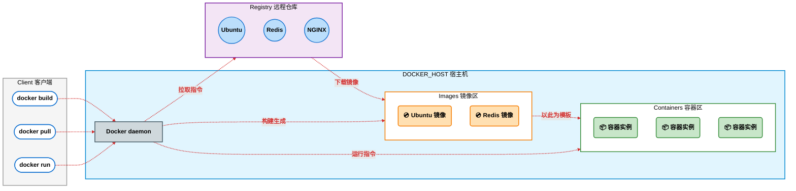

# Docker 核心运行流程图解分析

基于 Docker 的 **C/S（客户端/服务器）架构**，我们可以将图解中的 Docker 运行流程拆解为**三个核心组件**和**三条主要执行链路**。

---

## 一、 图中的三大核心组件

### 1. Client（Docker 客户端）
这是用户与 Docker 交互的入口。我们在终端执行的所有 Docker 命令（如 `docker build`、`docker pull`、`docker run`）均在此处生成，并通过 API 发送给后端的 Docker 守护进程。

### 2. DOCKER_HOST（Docker 宿主机）
这是实际运行 Docker 引擎的物理机或虚拟机。它包含以下三个关键部分：
* **Docker daemon（守护进程）**：Docker 的“大脑”，负责监听客户端请求，并管理本机的镜像、容器、网络等核心资源。
* **Images（本地镜像库）**：存放从远端下载或本地构建完成的只读镜像（如图中的 Ubuntu、Redis、Nginx 镜像等）。
* **Containers（容器实例）**：由镜像运行起来的实体，是实际执行应用程序的隔离环境。

### 3. Registry（远程镜像仓库）
存在于云端或内网的镜像托管服务（例如 Docker Hub 或阿里云镜像仓库）。其中存放着海量预先配置好的基础镜像，供用户随时拉取和下载。

---

## 二、 Docker 运行的三大核心流程

图中的虚线清晰地描绘了三种不同命令在 Docker 内部的流转过程：

### 1. 获取环境：`docker pull`（拉取镜像）
* **触发条件**：客户端 (Client) 输入 `docker pull <镜像名>`。
* **执行流转**：
  1. 指令发送至 **DOCKER_HOST** 中的 **Docker daemon**。
  2. 守护进程检测本地缺乏目标镜像，随即将请求转发至外网的 **Registry（远程镜像仓库）**。
  3. 从 Registry 将目标镜像下载并缓存至本地的 **Images（镜像区）**，以备后续使用。

### 2. 制作环境：`docker build`（构建镜像）
* **触发条件**：客户端 (Client) 输入 `docker build`（通常配合 Dockerfile）。
* **执行流转**：
  1. 指令及其相关的构建上下文被发送给 **Docker daemon**。
  2. 守护进程解析指令，利用基础镜像和提供的代码/配置进行逐层打包。
  3. 最终在本地的 **Images（镜像区）** 生成一个全新的自定义镜像。

### 3. 启动环境：`docker run`（运行容器）
* **触发条件**：客户端 (Client) 输入 `docker run <镜像名>`。
* **执行流转**：
  1. 指令发送给 **Docker daemon**。
  2. 守护进程首先在本地的 **Images（镜像区）** 检索是否存在指定镜像。
  3. 定位到镜像后，守护进程以此只读镜像为模板，分配必要的文件系统、网络和计算资源，在 **Containers（容器区）** 启动一个或多个运行实例。

> **💡 补充说明**：如果本地 Images 区未能找到该镜像，守护进程会自动触发 `pull` 流程，先从 Registry 下载，随后再执行运行操作。

---

## 三、 总结

整个流程完美诠释了 Docker 的核心运转逻辑：**客户端下达指令 ➡️ 守护进程接收并调度 ➡️ 从仓库拉取“环境模板”（Images） ➡️ 将“环境模板”运行为独立的“应用实例”（Containers）**。